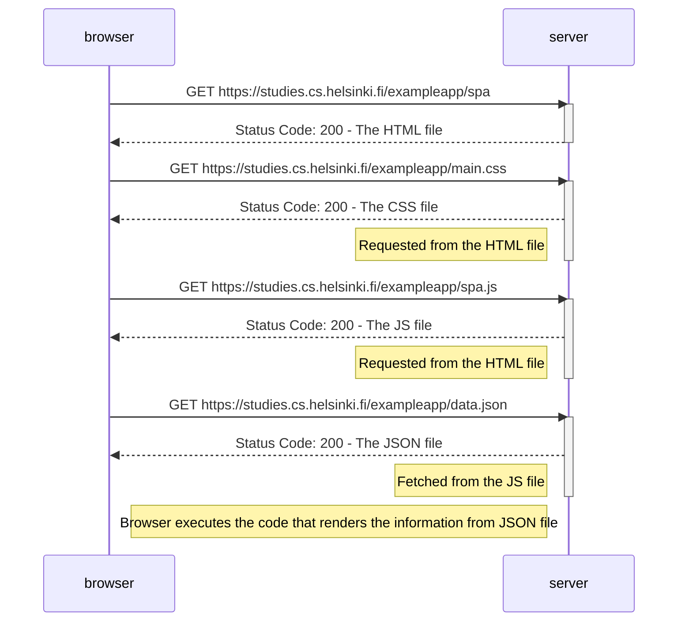

```mermaid

sequenceDiagram
    participant browser
    participant server

    browser->>server: GET https://studies.cs.helsinki.fi/exampleapp/spa
    activate server
    server-->>browser: Status Code: 200 - The HTML file
    deactivate server

    browser->>server: GET https://studies.cs.helsinki.fi/exampleapp/main.css
    activate server
    server-->>browser: Status Code: 200 - The CSS file
    Note left of server: Requested from the HTML file
    deactivate server

    browser->>server: GET https://studies.cs.helsinki.fi/exampleapp/spa.js
    activate server
    server-->>browser: Status Code: 200 - The JS file
    Note left of server: Requested from the HTML file
    deactivate server

    browser->>server: GET https://studies.cs.helsinki.fi/exampleapp/data.json
    activate server
    server-->>browser: Status Code: 200 - The JSON file
    Note left of server: Fetched from the JS file
    deactivate server

    Note right of browser: Browser executes the code that renders the information from JSON file

```