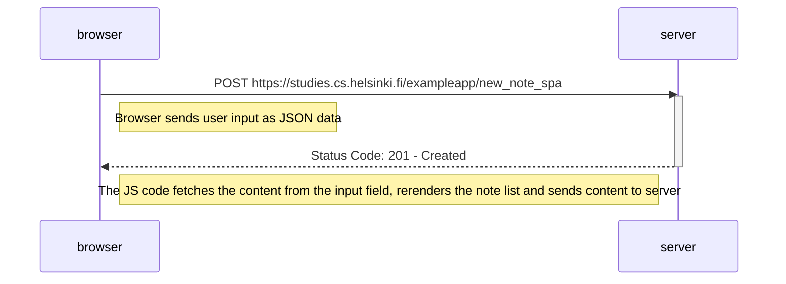

```mermaid

sequenceDiagram
    participant browser
    participant server

    browser->>server: POST https://studies.cs.helsinki.fi/exampleapp/new_note_spa
    activate server
    Note right of browser: Browser sends user input as JSON data
    server-->>browser: Status Code: 201 - Created
    deactivate server

    Note right of browser: The JS code fetches the content from the input field, rerenders the note list and sends content to server
```